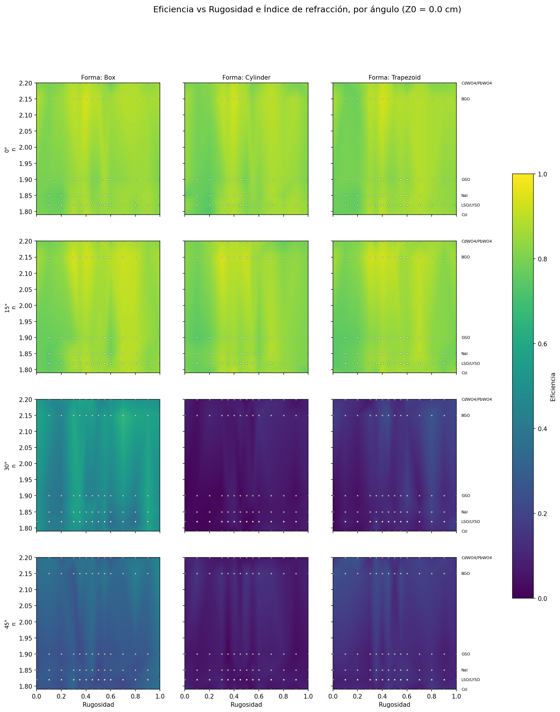

# Gráficos heatmap - Centellador G4.
Se cargaron 2 grupos :
## a) Cuando varia el punto de impacto z0, va de 0, 0.25, 0.5, 0.75 y 1cm
### Eficiencia Heatmap Z0 = 0.0 cm

## b) Cuando varia el Material, son 8 materiales
### Eficiencia heatmap Material=NaI

